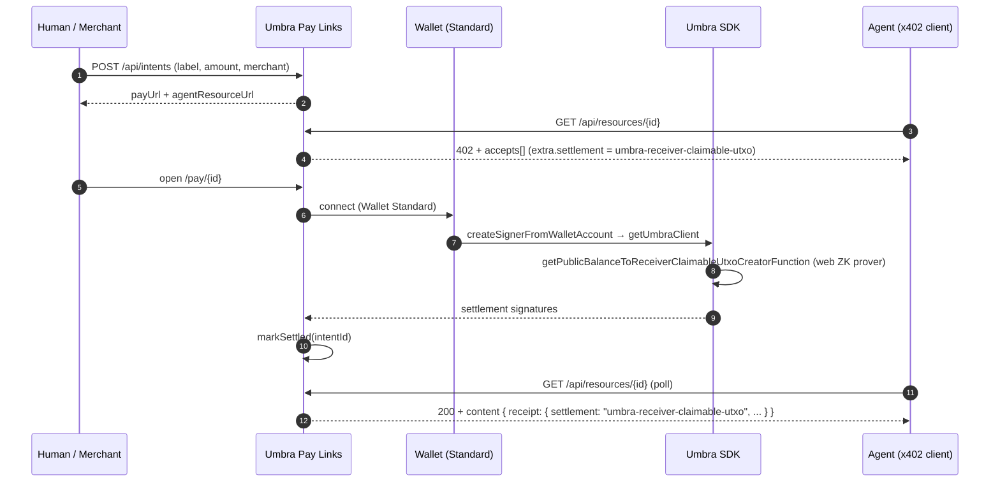

# Umbra Pay Links

[](https://solana.com/)
[](https://sdk.umbraprivacy.com/)
[](https://docs.g402.ai/docs/api/response-format)
[](https://nextjs.org/)
[](#tests)
[](#license)

Private payment links for **people and software** on Solana. Each intent is one server record with two faces: a human checkout URL and a machine-readable resource URL. The resource returns **HTTP 402** with x402-shaped JSON until settlement is recorded, then **200** with structured content. Settlement runs through the **Umbra SDK** (public USDC → receiver-claimable UTXO), in the browser **and** in a headless `npm run agent:pay` script — not a mocked transfer.

| | |
| --- | --- |
| **Live app** | [umbra-pay-links.vercel.app](https://umbra-pay-links.vercel.app/) |
| **API playground** | [/playground](https://umbra-pay-links.vercel.app/playground) — one-click `create → 402 → confirm → 200` |
| **Repository** | [panagot/Umbra-Pay-Links](https://github.com/panagot/Umbra-Pay-Links) |
| **Track** | [Umbra Side Track (Superteam Frontier)](https://superteam.fun/earn/listing/umbra-side-track) |
| **OpenAPI** | [/openapi.json](https://umbra-pay-links.vercel.app/openapi.json) |

---

## Why this exists

Typical "pay me" flows on Solana leave a **public graph** of who paid whom and for how much. Merchants and payers often want **transactional privacy**. At the same time, backends and agents need a **predictable protocol** — not just a browser QR flow.

Umbra Pay Links collapses both audiences onto **one record**:

- A **human checkout URL** (`/pay/<opaque-id>`) for wallets and humans.
- An **agent resource URL** (`/api/resources/<id>`) for automation, gated by HTTP 402.

The opaque id is the only thing that ever appears in the URL — the merchant address never leaks through the path.

**Who it helps**

| Audience | What they get |
| -------- | --------------- |
| **Merchants, creators, SaaS** | Shareable links: opaque id in the URL, not the recipient address in the path. |
| **Payers** | Familiar checkout: open link, connect wallet, pay; value moves on Umbra's confidential rails toward the merchant. |
| **Builders of agents and platforms** | One `GET` on the resource URL returns 402 + JSON until paid, then 200, in line with x402-style client expectations, with Umbra handling settlement. |

---

## Lifecycle at a glance



---

## Umbra SDK in this repo

Settlement is **real Umbra SDK usage**, not a server-side stand-in or a plain SPL shortcut.

**Dependencies (high level):** `@umbra-privacy/sdk`, `@umbra-privacy/web-zk-prover`, Wallet Standard (`@wallet-standard/*`), `@solana/kit` for typed addresses.

**Browser checkout (`PayWithUmbra`), in order:**

1. `createSignerFromWalletAccount` — Wallet Standard to Umbra signer.
2. `getUmbraClient` — network, RPC, WebSocket subscriptions, Umbra indexer.
3. `getUserAccountQuerierFunction` / `getUserRegistrationFunction` — Umbra identity when needed.
4. `getPublicBalanceToReceiverClaimableUtxoCreatorFunction` + `getCreateReceiverClaimableUtxoFromPublicBalanceProver` — public USDC to receiver-claimable UTXO for the merchant.

**Headless path:** `scripts/agent-pay.mjs` uses `createSignerFromPrivateKeyBytes` with the same pipeline so automation matches the browser.

**Server:** Persists intents, serves 402 resources, optional on-chain confirm gate (`REQUIRE_ONCHAIN_CONFIRM_FOR_SETTLE`), optional webhooks. Umbra programs are reached through the SDK from the client; this app does not ship its own Umbra program.

Viewing keys, selective disclosure, and private swaps are part of Umbra's wider roadmap. This prototype focuses on **private pay links** and an **x402-shaped agent surface**, aligned with the track's private payments and x402 prompts.

---

## In the app

1. **Create link** (`/`) — Form with client-side validation, toast feedback, drop-in `fetch` / `curl` / `agent:pay` snippets after creation.
2. **Demo center** (`/demo`) — Retail simulation and an agent-side 402 timeline (no wallet required).
3. **Platform sim** (`/demo/developer`) — SaaS API credits, fake terminal log, webhook inbox.
4. **API playground** (`/playground`) — Live REST tester that hits the real routes; `Run all` walks `create → 402 → confirm → 200` end-to-end.
5. **How it works**, **Settlement**, **Agents & APIs**, **Reference** — Documentation and code entry points.
6. **Webhook** (optional) on first successful settlement.

---

## Local development

```bash
npm install
cp .env.example .env.local   # optional
npm run dev
```

Open <http://localhost:3000>. Create an intent, complete payment on the pay link, then hit the resource URL again (or run `npm run agent:pay` with a funded keypair; see `.env.example` and the script header). For a fully in-browser walkthrough without a wallet, open `/playground` and click **Run all**.

### Tests

| Command | Purpose |
| ------- | ------- |
| `npm run test` / `npm run test:unit` | Vitest (helpers, rate limits, RPC verify) |
| `npm run test:e2e` | Playwright: main pages, OpenAPI, intent flow and 402 |
| `npm run test:smoke` | Quick `fetch` smoke (expects server at `BASE_URL`) |
| `npm run test:all` | Unit + E2E |

First-time Playwright: `npx playwright install chromium`

---

## References

- [Umbra SDK](https://sdk.umbraprivacy.com/) · [Quickstart](https://sdk.umbraprivacy.com/quickstart)
- [Umbra](https://umbraprivacy.com/)
- [x402 response format](https://docs.g402.ai/docs/api/response-format)
- OpenAPI in this app: [`/openapi.json`](https://umbra-pay-links.vercel.app/openapi.json)
- Superteam submission checklist: [`docs/SUBMISSION.md`](docs/SUBMISSION.md)

---

## License

MIT
